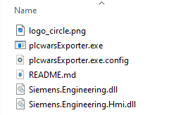

# TIA Portal V20 Block Manager

A tool for managing TIA Portal V20 blocks using the Openness API.

Link for the short yt presentation: https://youtu.be/zyyjSzqCNfo

## Prerequisites

- TIA Portal V20 installed
- TIA Portal Openness V20 installed
- User added to "Siemens TIA Openness" user group
- Valid TIA Portal and Openness licenses

## Required Siemens Files

The following files are required for the application to work but are **not** included in this repository due to licensing restrictions:

Required files:
- Siemens.Engineering.dll
- Siemens.Engineering.Hmi.dll



### Where to Get the Required Files

1. These files are part of your TIA Portal V20 installation. You can find them in:
   ```
   C:\Program Files\Siemens\Automation\Portal V20\PublicAPI\V20\
   ```

2. Copy these files to the same folder where you placed the plcwarsExporter.exe file

## Installation

1. Download repository and extract to folder
2. Copy the required Siemens files as described above to the same folder
3. Run plcwarsExporter.exe

## Current Known Limitations

1. Does not work correctly with nested blocks under folders
2. Does not export software units
3. Password Protected projects are not functional

## License

This project is licensed under the MIT License

**Important:** The Siemens libraries are subject to their respective licenses and terms of use. Users must have a valid TIA Portal V20 installation and comply with Siemens licensing terms.
